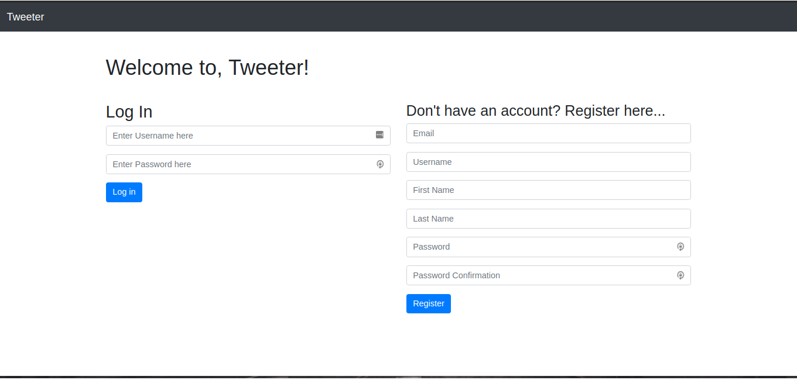
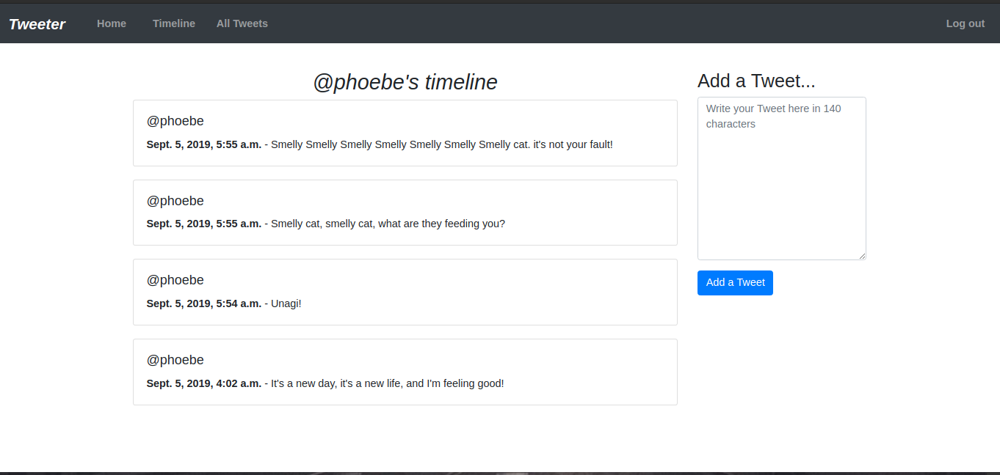
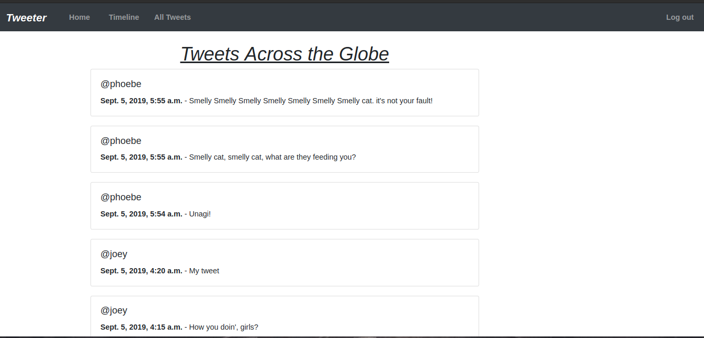

# Tweeter - Twitter with Django

###### A mini Twitter App - built with Django.


## Screenshots

###### Login & Registration Page


###### Tweeter timeline of Phoebe (logged in)


###### View Tweets Across the Globe



## Features
- Login using Django Authentication.
- Signup to create a user.
- Logged in user can post a tweet. (140 char limit).
- Logged in user can see the timeline of tweets created by them.
- Logged in user can see tweets from other users
    - Example: To see `joey`'s timeline, go to `localhost:8000/joey`
- Logged in user can see the tweets across the globe.

## For Developers

### Installation Instructions
- Run following commands after cloning the repository

```
# Go inside the directory containing the project
cd twitter-django

# Create virtual environment
virtualenv env

# Activate the virtualenv
source env/bin/activate

# Install requirements/libraries
pip install -r requirements.txt

# Go inside the 'tweeter' directory and run migrations
cd tweeter
python manage.py makemigrations
python manage.py migrate

```

#### Run the App
- In order to run the app, run following command and open `localhost:8000` in the browser once the development server has started.

```
python manage.py runserver
```

